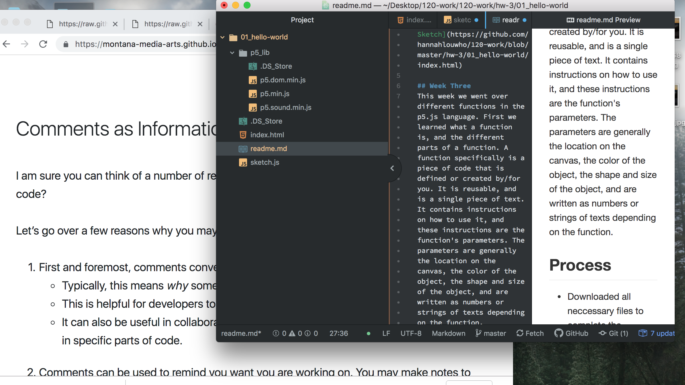

# Hannah Wheeler

["Hello World!" Sketch](https://github.com/hannahlouwho/120-work/blob/master/hw-3/01_hello-world/index.html)

## Week Three 
This week we went over different functions in the p5.js language. First we learned what a function is, and the different parts of a function. A function specifically is a piece of code that is defined or created by/for you. It is reusable, and is a single piece of text. It contains instructions on how to use it, and these instructions are the function's parameters. The parameters are generally the location on the canvas, the color of the object, the shape and size of the object, and are written as numbers or strings of texts depending on the function.

## Process
- Downloaded all neccessary files to complete the assigment
- Created a new directory called hw-3
- Open a sketch.js
- Follow along with instructions
    - creat a canvas
    - add color to the background
    - add text
- Save and push to GitHub
- Make link live

For the most part, this weeks assignment was pretty straight forward. I didn't have much trouble until the very end when I was trying to get my links to work(but I always have isssues with links). And since I have a lot of coding background I always feel like I am doing the assignments backwards and I think that confuses me.

## Github
I was not able to give a piece of advice on the issues board just yet because I have not looked at it yet but I will do that right after I finish this assignment.

## Workspace

